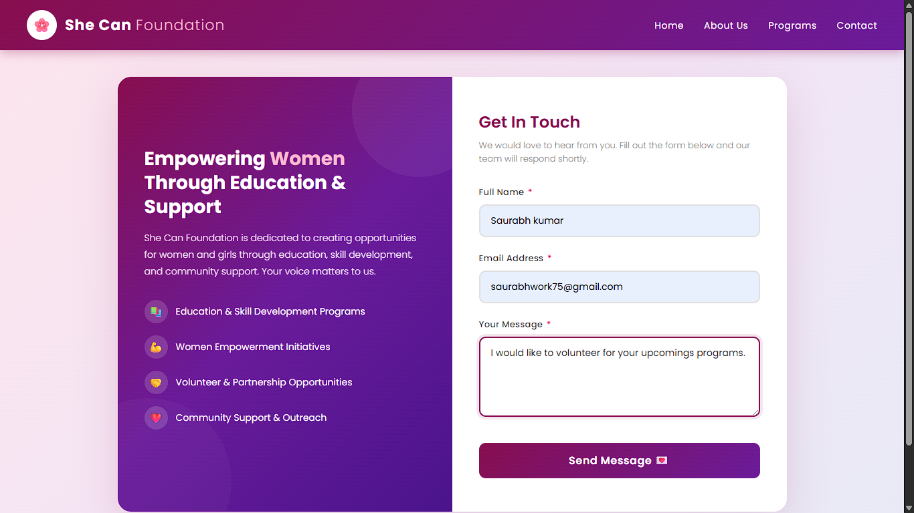
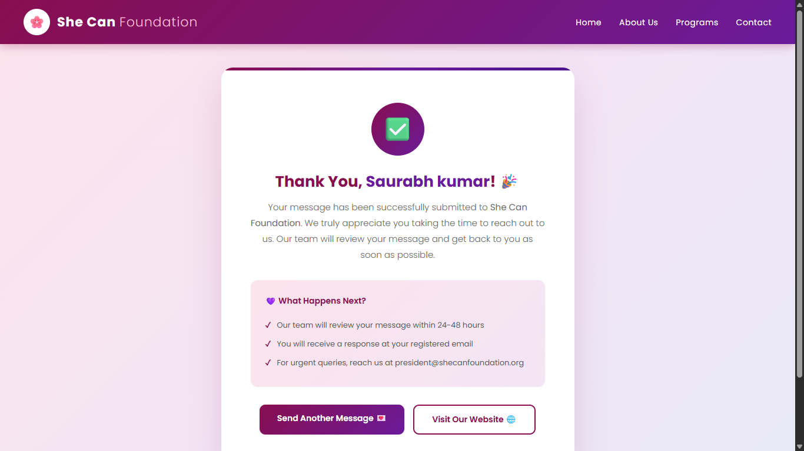
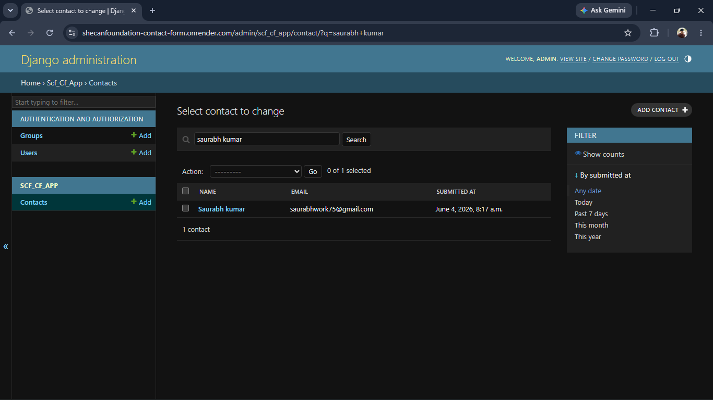
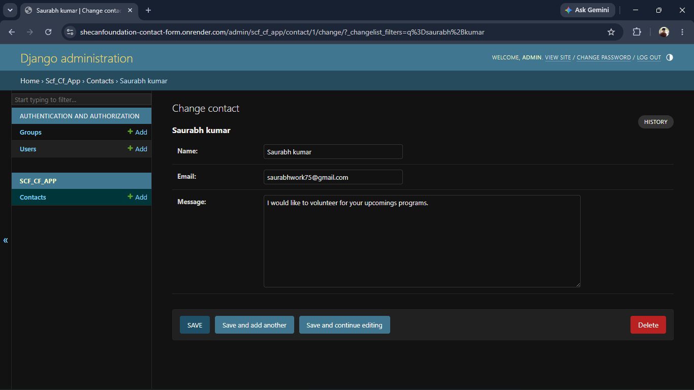

<h1 align="center">🌸 She Can Foundation - Contact Form</h1>

<p align="center">
  <a href="https://shecanfoundation-contact-form.onrender.com/">
    
  </a>
</p>

<p align="center">
  
  
  
  
  
  
  
</p>

---

A fully responsive **Contact Form Web Application** built for the **She Can Foundation**, an organization dedicated to empowering women through education, skill development, and community support.  
This project allows visitors to easily reach out to the foundation, while administrators can manage all submitted messages through a secure Django Admin Dashboard.

---

## 📖 Table of Contents
- [About the Project](#-about-the-project)
- [Features](#-features)
- [Tech Stack](#-tech-stack)
- [Screenshots](#-screenshots)
- [Installation & Setup](#-installation--setup)
- [Deployment on Render](#-deployment-on-render)
- [Project Structure](#-project-structure)
- [License](#-license)
- [Author](#-author)

---

## 📌 About the Project

The **She Can Foundation Contact Form** is a Django-based web application designed to:
- Let users contact the foundation directly through a clean, modern form.
- Store all submissions securely in the database.
- Allow administrators to manage, search, edit, and delete user submissions through the Django Admin Panel.

The website is fully **responsive** and works seamlessly on **desktop, tablet, and mobile devices**.

---

## ✨ Features

✅ Beautiful, modern, and responsive UI  
✅ Fully functional contact form with validation  
✅ Success confirmation page after submission  
✅ Secure Django Admin Dashboard  
✅ Search, filter, and manage user submissions  
✅ Mobile-friendly design  
✅ Deployed live on Render  

---

## 🛠 Tech Stack

| Category        | Technology Used |
|-----------------|------------------|
| **Backend**     | Django (Python)  |
| **Frontend**    | HTML5, CSS3      |
| **Database**    | SQLite (default) |
| **Deployment**  | Render           |
| **Version Control** | Git & GitHub |

---

## 📸 Screenshots

### 📝 Contact Form Page
The main page where users can enter their name, email, and message to contact the foundation.


### ✅ Successful Submission Page
A friendly thank-you page shown after a message is successfully submitted.


### 🛡️ Admin Dashboard Page
Django-powered admin panel that lists all user contact submissions with search and filter options.


### 👤 User Details Page
Admins can view and edit individual contact submissions in detail.


### 📱 Mobile View
The site is fully responsive and optimized for mobile devices.


---

## ⚙️ Installation & Setup

Follow these steps to run the project locally on your machine:

### 1️⃣ Clone the Repository
```bash
git clone https://github.com/Skwork75/shecanfoundation_contact_form.git
cd shecanfoundation_contact_form
```

### 2️⃣ Create & Activate Virtual Environment
```bash
python -m venv venv
# For Windows
venv\Scripts\activate
# For Mac/Linux
source venv/bin/activate
```

### 3️⃣ Install Dependencies
```bash
pip install -r requirements.txt
```

### 4️⃣ Apply Migrations
```bash
python manage.py migrate
```

### 5️⃣ Create Superuser (for Admin Access)
```bash
python manage.py createsuperuser
```

### 6️⃣ Run the Development Server
```bash
python manage.py runserver
```

Now open your browser and visit 👉 `http://127.0.0.1:8000/`

---

## 🚀 Deployment on Render

This project is deployed on **Render** for free hosting.

### 🧩 Render Deployment Workflow:

1. **Push your code to GitHub.**
2. Go to [https://render.com](https://render.com) and log in.
3. Click on **New + → Web Service**.
4. Connect your GitHub repository.
5. Configure the following settings:

| Setting              | Value |
|----------------------|-------|
| **Environment**      | Python 3 |
| **Build Command**    | `pip install -r requirements.txt && python manage.py collectstatic --noinput && python manage.py migrate` |
| **Start Command**    | `gunicorn shecanfoundation_contact_form.wsgi` |
| **Branch**           | `main` |

6. Add environment variables (if needed):
   - `SECRET_KEY` = your-django-secret-key
   - `DEBUG` = False
   - `ALLOWED_HOSTS` = your-app-name.onrender.com

7. Click **Deploy** 🎉  
Your site will be live at:  
👉 `https://your-app-name.onrender.com`

---

## 📂 Project Structure

```
shecanfoundation_contact_form/
│
├── scf_cf_app/                      # Main Django app
│   ├── migrations/
│   ├── templates/
│   ├── static/
│   ├── models.py
│   ├── views.py
│   ├── urls.py
│   └── admin.py
│
├── shecanfoundation_contact_form/   # Project settings
│   ├── settings.py
│   ├── urls.py
│   └── wsgi.py
│
├── screenshots/                     # Project screenshots
├── manage.py
├── requirements.txt
└── README.md
```

---

## 📜 License

This project is licensed under the **MIT License** — you are free to use, modify, and distribute this project with proper credit.

```
MIT License

Copyright (c) 2025 Saurabh Kumar

Permission is hereby granted, free of charge, to any person obtaining a copy
of this software and associated documentation files (the "Software"), to deal
in the Software without restriction, including without limitation the rights
to use, copy, modify, merge, publish, distribute, sublicense, and/or sell
copies of the Software, and to permit persons to whom the Software is
furnished to do so, subject to the following conditions:

The above copyright notice and this permission notice shall be included in all
copies or substantial portions of the Software.

THE SOFTWARE IS PROVIDED "AS IS", WITHOUT WARRANTY OF ANY KIND, EXPRESS OR
IMPLIED, INCLUDING BUT NOT LIMITED TO THE WARRANTIES OF MERCHANTABILITY,
FITNESS FOR A PARTICULAR PURPOSE AND NONINFRINGEMENT. IN NO EVENT SHALL THE
AUTHORS OR COPYRIGHT HOLDERS BE LIABLE FOR ANY CLAIM, DAMAGES OR OTHER
LIABILITY, WHETHER IN AN ACTION OF CONTRACT, TORT OR OTHERWISE, ARISING FROM,
OUT OF OR IN CONNECTION WITH THE SOFTWARE OR THE USE OR OTHER DEALINGS IN THE
SOFTWARE.
```

---

## 👨‍💻 Author

**Saurabh Kumar**  
💻 GitHub: [@Skwork75](https://github.com/Skwork75)  
📧 Email: saurabhwork75@gmail.com  

---

<p align="center">⭐ <i>If you like this project, don't forget to give it a star on GitHub!</i> ⭐</p>
